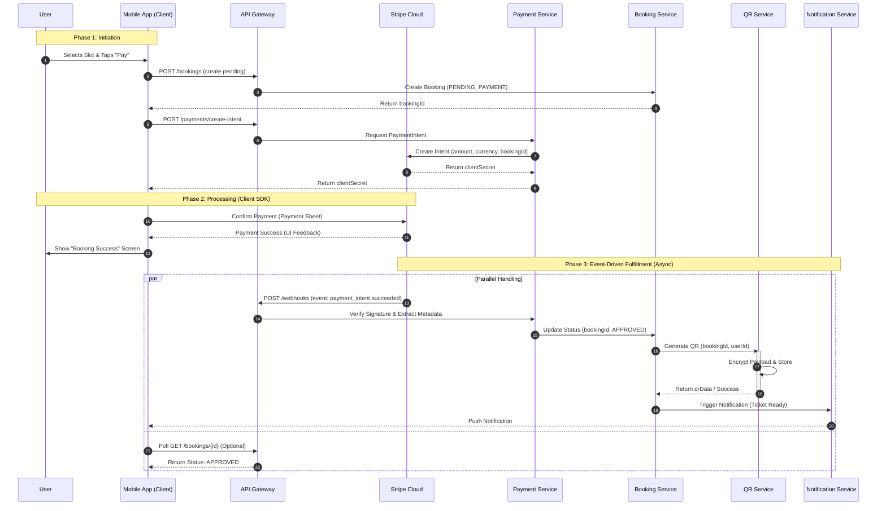

Based on the **Paid Event Workflow** described in the PRD and the **Microservices Architecture** detailed in the Technical Stack document, here is the Markdown file containing the event-driven flow diagram.

***

# Event-driven Flow: Stripe → Booking → QR

This document details the asynchronous, event-driven workflow that occurs when a user purchases a ticket for a Paid Event. The process relies on **Stripe Webhooks** to decouple payment processing from internal booking logic and QR code generation.

## **Flow Overview**
1.  **Booking Initiation**: User reserves a slot; a `PENDING_PAYMENT` booking is created.
2.  **Payment Processing**: Client interacts directly with Stripe via the Mobile SDK.
3.  **Event Trigger**: Stripe sends a `payment_intent.succeeded` webhook to the backend.
4.  **Fulfillment**: The backend validates the payment, approves the booking, and generates the QR entry code.

## **Detailed Component Interactions**

### **1. Payment Service (The Listener)**
*   **Role**: Acts as the entry point for financial events.
*   **Action**: Listens for the `payment_intent.succeeded` event from Stripe.
*   **Security**: Verifies the webhook signature to ensure the request genuinely originated from Stripe.
*   **Output**: extracts the `bookingId` from the payment metadata and notifies the Booking Service.

### **2. Booking Service (The Orchestrator)**
*   **Pre-condition**: The booking exists in the database with status `PENDING_PAYMENT`.
*   **Action**: Upon receiving the success signal from the Payment Service, it transitions the booking status to `APPROVED`.
*   **Trigger**: Once approved, it immediately requests a secure entry code from the QR Service.

### **3. QR & Entry Service (The Generator)**
*   **Action**: Generates a unique, encrypted string linked to the `userId` and `eventId`.
*   **Storage**: Persists the code in Redis/MongoDB with a status of `ACTIVE`.
*   **Constraint**: Ensures strict single-use enforcement for the future entry scan.

### **4. Notification Service (The Informant)**
*   **Action**: Sends a push notification or email to the user confirming that their ticket is ready.
*   **User Experience**: The user receives a "Payment Successful" notification, and the ticket appears in the "My Tickets" tab with an `APPROVED` badge.

## **Database State Transitions**

| Service | Collection/Table | State Before Webhook | State After Webhook |
| :--- | :--- | :--- | :--- |
| **Booking** | `bookings` | `status: "PENDING_PAYMENT"` | `status: "APPROVED"` |
| **Payment** | `transactions` | `status: "requires_payment_method"` | `status: "succeeded"` |
| **QR** | `qr_codes` | *(Record does not exist)* | `status: "ACTIVE"` |

---
*Sources: PRD Section 7 (Paid Event Workflow), PRD Section 12 (Microservices), Technical Stack Section 5.5 (Payment Service).*